# Coding Challenge
## Crypto Analyzer

You can access the website : http://coding-challenge-skyler.s3-website-ap-southeast-2.amazonaws.com/


Using coingecko API to get coin lists and information using React for the Frontend Developer Coding Challenge

- Display a paginated list of Cryptocurrencies
- For the Visible Cryptocurrencies, provide further information in any form you find appropriate
- Be able to filter the list by Cryptocurrency name / symbol
- Provide a loading / error state whilst data is being pulled
- Create a seperate Tab/Page for Trending results based on Volume
- Showcase your creativity and brand the components you create
- Provide a component with Global Market information (further discuss later )


## Tech

- ReactJS
- ESLint
- Jest
- AWS S3

## Features

- Search Coins
- Paginations
- Tables
- Watchlist
- User Guid


## Installation

```sh
npm install
npm start
```


## Detail
* <details>
  <summary>
   Unfold
  </summary>
    <br>

    Result Pictures
    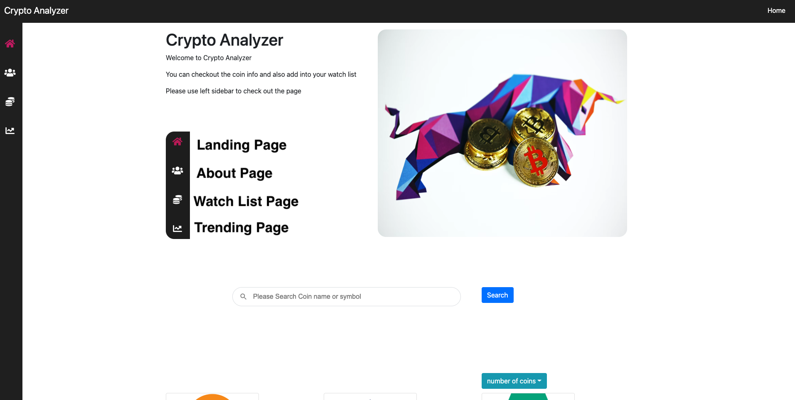 
    Landing Page
    <br>
  
  
   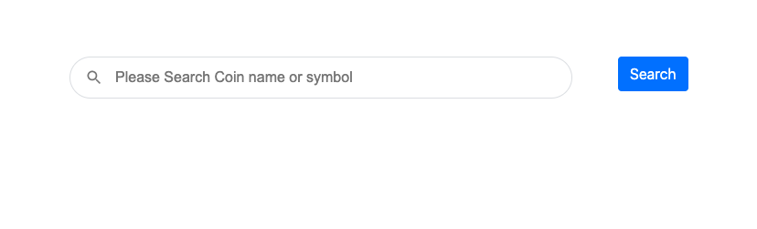 
    main serach function
    <br>
  
   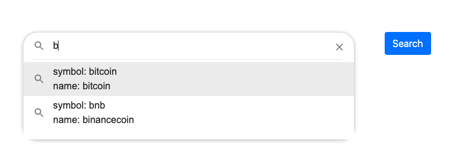 
    main serach function
    <br>
   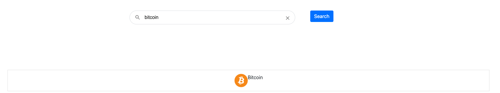 
    main serach function
    <br>
   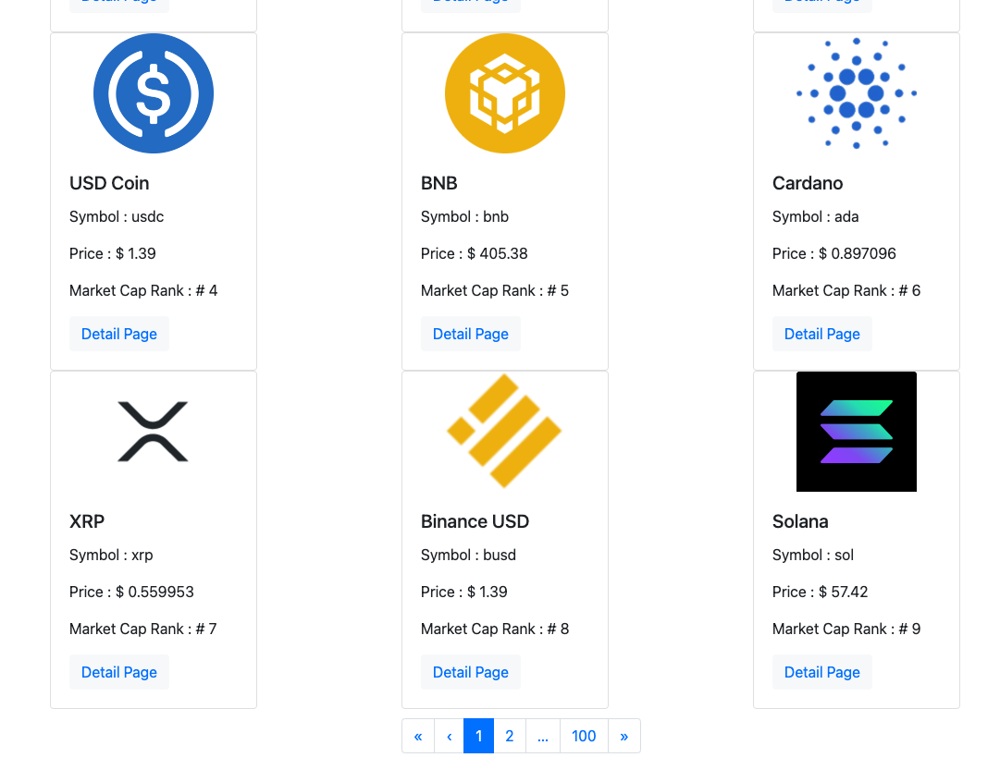 
   coinlist
    <br>
  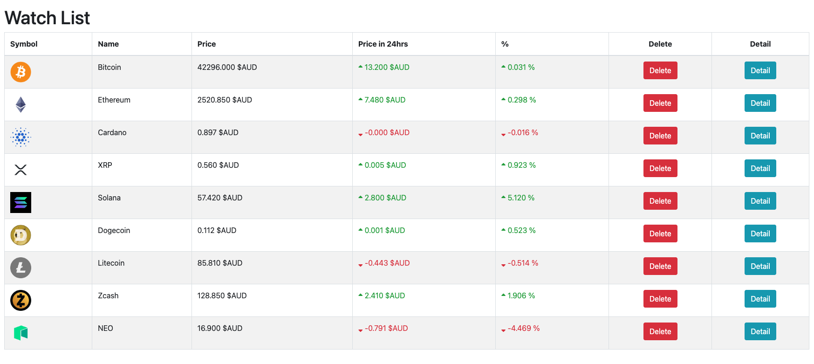 
   watchlist
    <br>
  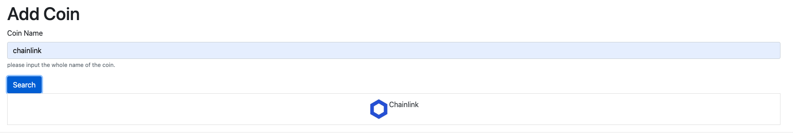 
   watchlist
    <br>
  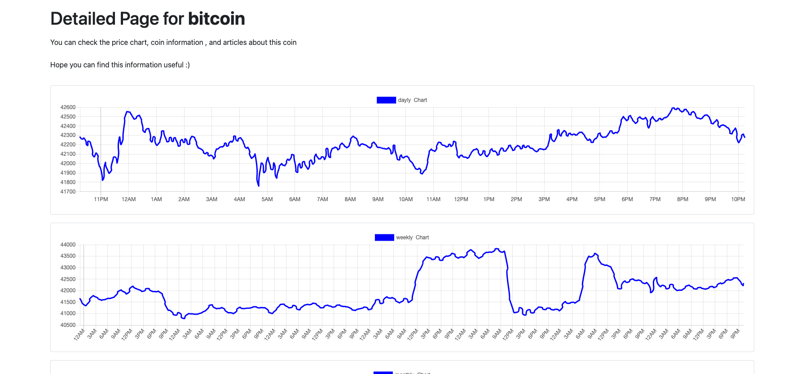 
   detail page - charts
    <br>
   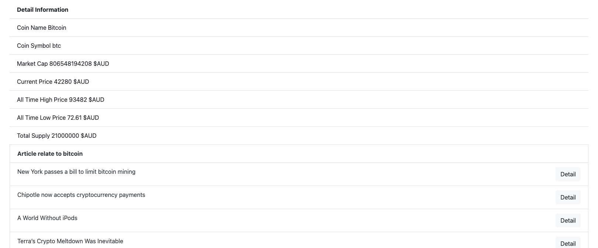 
   detail page - coin info and related articles
    <br>
  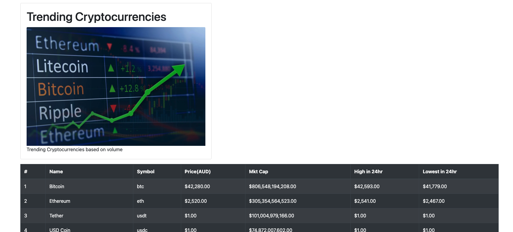 
   trending page
    <br>
   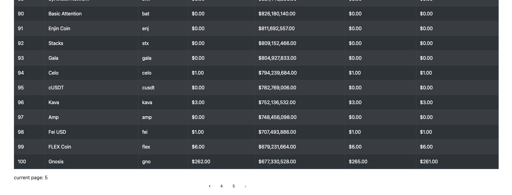 
   trending page show pagination
    <br>
     
   errpr state
    <br>
     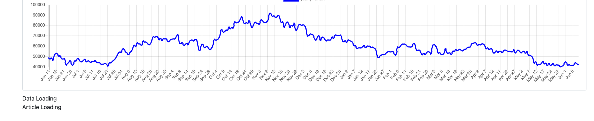 
   loading state
    <br>


## Challengs
- CORS problem 
    In local development server , it is possible to get news articles using NEWSAPI 
     hoever in S3, there is CORS error ... It wont get the data from api

- Unit Test
    Not familiar with components unit testing.
    
